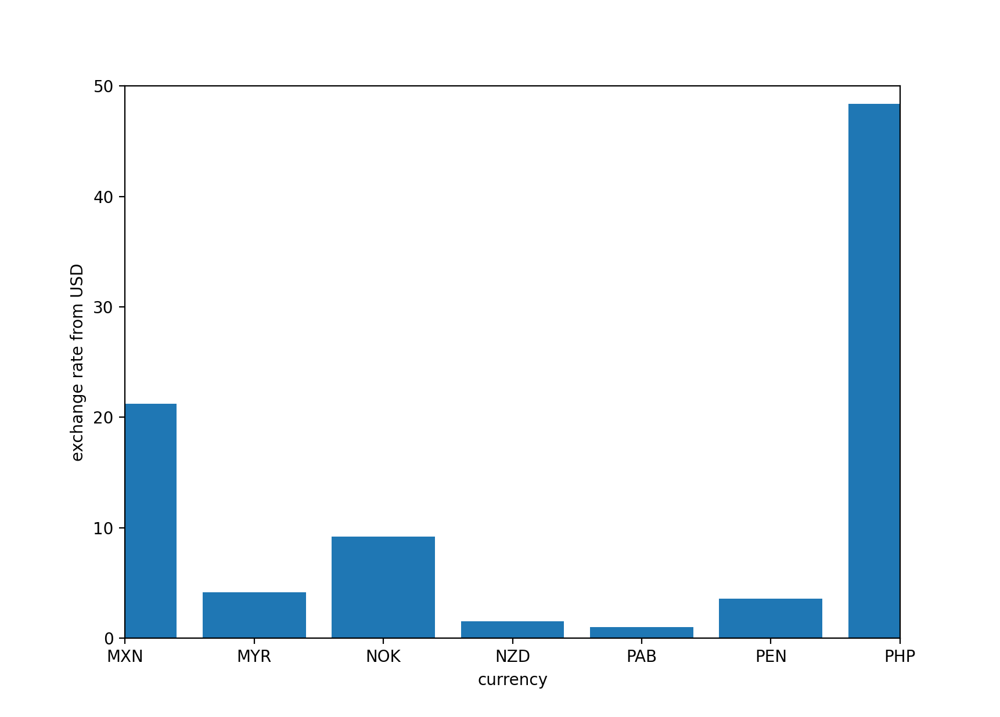
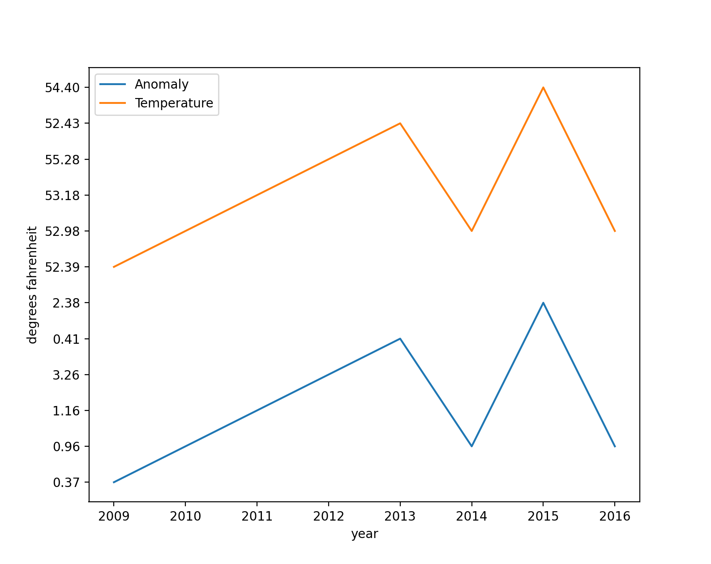

# Data

## USD Exchange Rate Compared to Other Countires

The Data in this bar graph compares the USD currency to other different currencies. The compared currencies are that of Mexico(MXN), Malaysia(MYR), Norway(NOK), New Zealand(NZD), Panama(PAB), Peru(PEN), and the Philippines(PHP). The graph demonstrates that the value behind different currencies across the world are widely varied. It also demonstrates the value of the $USD compared to other currencies. The data for this plot was found on [CurrencyData](https://api.exchangerate-api.com/v4/latest/USD)

## U.S. Annual Temperature and Anomalies

This graph displays the relationship between Temperature in the U.S. and the anomalies of the varied temperature levels throughout the years. Within this graph, you can see the varied levels in temperature in recent history. It also displays the accuracy of the measured anomaly values, as both of the plots are parallel at all x values.  The data for this plot was found on [TemperatureData](https://www.ncdc.noaa.gov/cag/national/time-series/110-tavg-ytd-12-1895-2016.json?base_prd=true&begbaseyear=1901&endbaseyear=2000)

[ProjectWebpage](https://github.com/mikeizbicki/cmc-csci040/tree/2020fall/hw_02)
